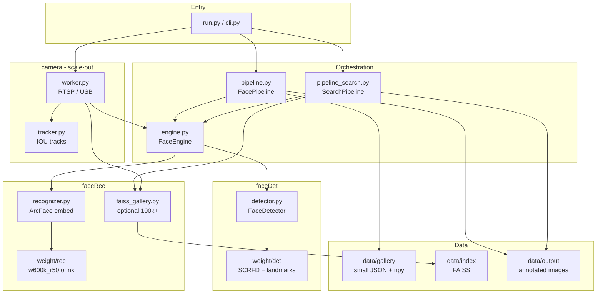
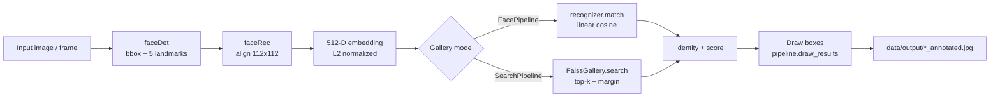
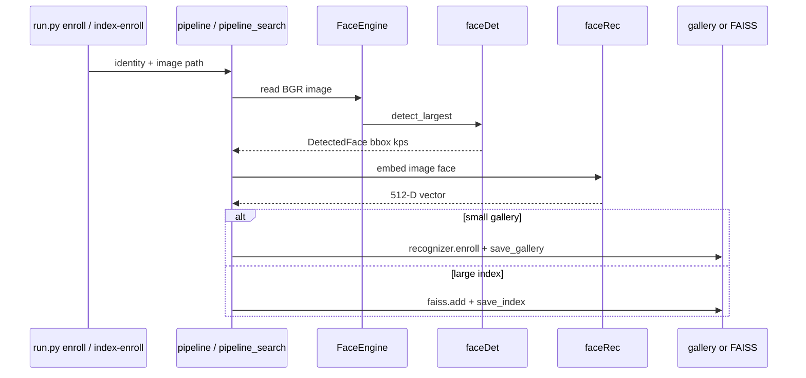
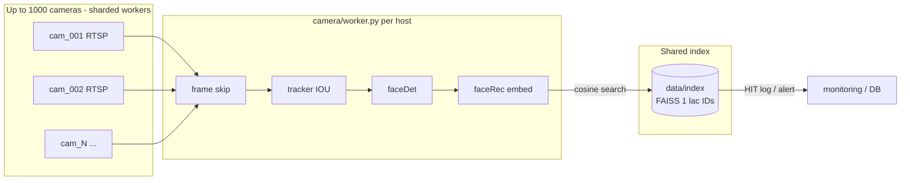

# faceRec

Face **detection** + **recognition** pipeline using InsightFace (`buffalo_l`): RetinaFace detection, landmark alignment, and ArcFace embeddings. Supports a small on-disk gallery for development and a **FAISS** index for large watchlists (100k+), plus multi-camera ingest.

## Pipeline overview

The system is split into **detection** (`faceDet`), **recognition** (`faceRec`), and **orchestration** (`engine` + `pipeline` / `pipeline_search`). ONNX weights live under `weight/det` and `weight/rec`.

### System diagram



### Per-image processing flow (verify)



### Enrollment flow



### Multi-camera + large gallery (production shape)



### Module map

| Stage | Folder / file | Input | Output |
|-------|----------------|-------|--------|
| Load models | `engine.py` | `weight/det`, `weight/rec` | `FaceDetector` + `FaceRecognizer` |
| Detect | `faceDet/detector.py` | BGR image | `DetectedFace` (bbox, score, landmarks) |
| Embed | `faceRec/recognizer.py` | image + face | 512-D ArcFace vector |
| Match (small) | `faceRec/recognizer.py` | embedding | `MatchResult` vs `data/gallery` |
| Match (large) | `faceRec/faiss_gallery.py` | embedding | `IndexMatch` vs `data/index` |
| Orchestrate | `pipeline.py` | CLI / API | detect → embed → match → draw |
| Scale search | `pipeline_search.py` | same | uses FAISS instead of dict loop |
| Bulk enroll | `faceRec/bulk_enroll.py` | CSV or folders | many vectors → index |
| Live streams | `camera/worker.py` | `data/cameras.yaml` | search index per track |

### ASCII pipeline (single image)

```
  ┌─────────────┐     ┌──────────────┐     ┌─────────────┐
  │ BGR image   │────▶│  faceDet     │────▶│  faceRec    │
  │ .jpg / frame│     │ weight/det   │     │ weight/rec  │
  └─────────────┘     │ bbox + kps   │     │ 512-D emb   │
                      └──────────────┘     └──────┬──────┘
                                                  │
                    ┌─────────────────────────────┴─────────────────────────────┐
                    ▼                                                           ▼
           ┌─────────────────┐                                      ┌──────────────────┐
           │ FacePipeline    │                                      │ SearchPipeline   │
           │ data/gallery    │                                      │ data/index FAISS │
           └────────┬────────┘                                      └────────┬─────────┘
                    ▼                                                           ▼
           ┌─────────────────────────────────────────────────────────────────────────────┐
           │ pipeline.draw_results  →  data/output/<image>_annotated.jpg               │
           └─────────────────────────────────────────────────────────────────────────────┘
```

## Project layout

```
faceRec/
├── run.py                 # Entry point: python run.py <command>
├── cli.py                 # All CLI commands
├── config.py              # Paths, thresholds, camera limits
├── engine.py              # Single load: weight/det + weight/rec
├── pipeline.py            # FacePipeline (small gallery)
├── pipeline_search.py     # SearchPipeline (FAISS index)
├── weight_sync.py         # Sync ONNX into weight/
├── faceDet/
│   └── detector.py        # Detection + landmarks
├── faceRec/
│   ├── recognizer.py      # Embeddings + small gallery
│   ├── faiss_gallery.py   # Large-scale vector search
│   └── bulk_enroll.py     # CSV / folder batch enroll
├── camera/
│   ├── worker.py          # RTSP / USB streams
│   └── tracker.py         # IOU tracking (rate-limit embeds)
├── weight/
│   ├── det/               # det_10g.onnx, 2d106det.onnx
│   └── rec/               # w600k_r50.onnx
└── data/
    ├── gallery/           # Small gallery (*.npy + gallery.json)
    ├── index/             # FAISS (faces.index + ids.json)
    ├── cameras.yaml       # Multi-camera config
    ├── samples/           # Test images
    └── output/            # Annotated results
```

## Requirements

- Python 3.10+
- Conda env recommended (e.g. `ml`)

```bash
conda activate ml
cd faceRec
pip install -r requirements.txt
```

First run downloads `buffalo_l` and **copies** ONNX files into `weight/det` and `weight/rec` (real files, not broken symlinks):

```bash
python run.py weights --force   # ~326 MB download first time
python run.py doctor
```

If `weight/**/*.onnx` is missing, run `python run.py weights --force` again.

## Quick start

```bash
conda activate ml
cd /path/to/faceRec

# Health check
python run.py doctor

# Small gallery (tens–hundreds of people)
python run.py enroll --name alice --image /path/to/face.jpg
python run.py verify --image /path/to/photo.jpg
# → data/output/<name>_annotated.jpg

# Large index (FAISS)
python run.py index-enroll --name alice --image /path/to/face.jpg
python run.py index-build --from-gallery          # import data/gallery/*.npy
python run.py index-verify --image /path/to/photo.jpg
python run.py index-info

# Smoke test (doctor + index + verify on sample)
python run.py test
```

## CLI reference

| Command | Purpose |
|---------|---------|
| `doctor` | Check deps and load models |
| `weights` | Link/copy ONNX into `weight/det` and `weight/rec` |
| `enroll` / `verify` / `list` | Small gallery in `data/gallery` |
| `webcam` | Single USB camera |
| `index-enroll` | Add one face to FAISS |
| `index-build` | Bulk build index (`--manifest`, `--folder`, `--from-gallery`) |
| `index-verify` | Match image against FAISS |
| `index-info` | Vector count in index |
| `cameras` | Streams from `data/cameras.yaml` |
| `test` | End-to-end smoke test |

### Index build options

```bash
# Rebuild from scratch (default)
python run.py index-build --from-gallery
python run.py index-build --folder data/enroll
python run.py index-build --manifest enroll.csv

# Add to existing index
python run.py index-build --manifest new.csv --append

# Faster search at very large N (after enough vectors)
python run.py index-build --folder data/enroll --ivf
```

**Folder enroll layout:** `data/enroll/<person_id>/*.jpg`

**CSV manifest:** columns `identity`, `image_path` (see `data/enroll_manifest.example.csv`)

## Configuration (`config.py`)

| Setting | Default | Notes |
|---------|---------|--------|
| `MODEL_NAME` | `buffalo_l` | Use `buffalo_sc` for speed |
| `MATCH_THRESH` | `0.45` | Raise for larger galleries |
| `SEARCH_MARGIN` | `0.08` | Top1 − top2 gap for FAISS |
| `DET_SIZE` | `(640, 640)` | Larger helps small faces |
| `CAMERA_MAX_STREAMS` | `32` | Per process; scale out for 1000 cams |

GPU: install `onnxruntime-gpu` matching your CUDA version. CPU-only machines use `CPUExecutionProvider` automatically.

## Multi-camera

Edit `data/cameras.yaml`:

```yaml
cameras:
  - id: cam_001
    url: 0                    # USB index
  - id: cam_002
    url: rtsp://host/stream1
```

```bash
python run.py cameras --show    # preview windows
python run.py cameras           # headless, logs matches
```

For many cameras: run **multiple worker processes**, each with a subset of cameras in YAML and shared `data/index/`.

## Python API

```python
from pipeline import FacePipeline

pipe = FacePipeline()
pipe.enroll_file("alice", "alice.jpg")
pipe.save_gallery()
for r in pipe.process_file("group.jpg"):
    print(r.match.identity, r.match.score)
```

```python
from pipeline_search import SearchPipeline

pipe = SearchPipeline()
pipe.enroll_index_file("alice", "alice.jpg")
pipe.save_index()
for r in pipe.process_file("group.jpg"):
    print(r.match.identity, r.match.score)
```

## Scaling notes

- **100k identities:** FAISS in `faceRec/faiss_gallery.py`; optional `--ivf` for ANN search.
- **1000 cameras:** frame skip + tracking in `camera/`; horizontal scale (many hosts/GPUs), not one machine on full FPS.

## References & links

This project uses the **InsightFace** stack (`buffalo_l` by default): **SCRFD** detection, **2d106** landmarks, **ArcFace** recognition on **WebFace600K** (`w600k_r50.onnx`).

### Papers (methods used in `weight/`)

| Topic | Paper | Link |
|-------|--------|------|
| **Face recognition (ArcFace)** | Deng et al., *ArcFace: Additive Angular Margin Loss for Deep Face Recognition*, CVPR 2019 | [arXiv:1801.07698](https://arxiv.org/abs/1801.07698) · [CVPR open access](https://openaccess.thecvf.com/content_CVPR_2019/html/Deng_ArcFace_Additive_Angular_Margin_Loss_for_Deep_Face_Recognition_CVPR_2019_paper.html) |
| **Face detection (RetinaFace)** | Deng et al., *RetinaFace: Single-Shot Multi-Level Face Localisation in the Wild*, CVPR 2020 | [arXiv:1905.00641](https://arxiv.org/abs/1905.00641) · [CVPR open access](https://openaccess.thecvf.com/content_CVPR_2020/html/Deng_RetinaFace_Single-Shot_Multi-Level_Face_Localisation_in_the_Wild_CVPR_2020_paper.html) |
| **Face detection (SCRFD)** | Guo et al., *Sample and Computation Redistribution for Efficient Face Detection*, ICLR 2022 | [arXiv:2105.04714](https://arxiv.org/abs/2105.04714) |
| **Large-scale training (Partial FC)** | An et al., *Partial FC: Training 10 Million Identities on a Single Machine*, CVPR 2022 | [arXiv:2203.15565](https://arxiv.org/abs/2203.15565) |
| **Vector search (FAISS)** | Johnson et al., *Billion-scale similarity search with GPUs* | [arXiv:1702.08734](https://arxiv.org/abs/1702.08734) |

### GitHub & official resources

| Resource | Description |
|----------|-------------|
| [deepinsight/insightface](https://github.com/deepinsight/insightface) | Main toolbox (detection, recognition, training code) |
| [Model Zoo README](https://github.com/deepinsight/insightface/blob/master/model_zoo/README.md) | `buffalo_l` / `buffalo_sc` packs and benchmarks |
| [Python package](https://github.com/deepinsight/insightface/tree/master/python-package) | `pip install insightface` — `FaceAnalysis`, ONNX runtime |
| [Model releases (buffalo_l zip)](https://github.com/deepinsight/insightface/releases) | Pretrained ONNX packs downloaded by this repo into `data/insightface/` |
| [SCRFD code](https://github.com/deepinsight/insightface/tree/master/detection/scrfd) | Detector used in `buffalo_l` (`det_10g.onnx`) |
| [ArcFace PyTorch](https://github.com/deepinsight/insightface/tree/master/recognition/arcface_torch) | Recognition training reference |
| [InspireFace SDK](https://github.com/deepinsight/insightface/tree/master/cpp-package/inspireface) | Cross-platform C/C++ SDK (2024+) |
| [facebookresearch/faiss](https://github.com/facebookresearch/faiss) | Library used for `data/index` large-gallery search |

### Related surveys & benchmarks

| Resource | Link |
|----------|------|
| InsightFace project site | [insightface.ai](https://insightface.ai) |
| NIST FRVT (industry benchmark) | [frvt.nist.gov](https://www.nist.gov/programs-projects/face-recognition-vendor-test-frvt) |

**Licensing:** InsightFace **code** is open source; **model weights** (e.g. `buffalo_l`) are typically for **non-commercial research** unless you obtain a [commercial license](https://www.insightface.ai/solutions/face-recognition-licensing). Check terms before production deployment.

## License & privacy

Face biometrics may be regulated in your region. Use consent, retention limits, and access controls for production deployments.
